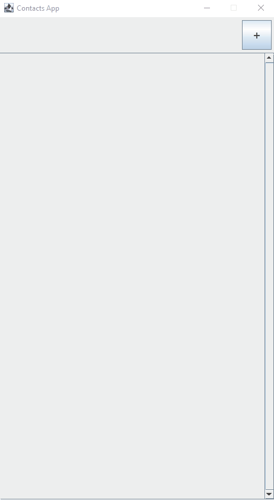

# Contacts Application

This application is a simple contacts application that lets user create, read, update and delete finnish contacts from a csv file. It was developed as Introduction to Programming -course project for practice with an emphasis on learning and understanding object oriented programming.

## Table of Contents

1. [Files](#files)
2. [Features](#features)
3. [Installation](#installation)
4. [How to Use](#how-to-use)
5. [Screencast](#screencast)
6. [Author](#author)

## Files

* `contactsapp/src/ContactsApp.java`: The ContactsApp class serves as the entry point to the application, which is a simple contacts application where user can create, read, update and delete Finnish contacts from a csv file.
- `contactsapp/src/contact/Contact.java`: The Contact class is used in adding, updating and reading contacts from the contacts database.
+ `contactsapp/src/contact/ContactDatabase`: The ContactDatabase class is used in the database csv file handling.
* `contactsapp/src/gui/ContactButton`: The ContactButton class is used in listing contacts and in retrieving their personal information from the database.
- `contactsapp/src/gui/GuiAddUpdate`: A GuiMode state for the GuiFrame.
+ `contactsapp/src/gui/GuiContact`: A GuiMode state for the GuiFrame.
* `contactsapp/src/gui/GuiFrame`: The GuiFrame class extends JFrame and implements ActionListener.
- `contactsapp/src/gui/GuiInvalidInput`: A GuiMode state for the GuiFrame.
+ `contactsapp/src/gui/GuiList`: A GuiMode state for the GuiFrame.
* `contactsapp/src/gui/GuiMode`: The GuiMode class is used to set the different states of the GUI.
- `contactsapp/src/validator/ApartmentValidator`: Utility class for validating apartment address input.
+ `contactsapp/src/validator/CityValidator`: Utility class for validating city input.
* `contactsapp/src/validator/EmailValidator`: Utility class for validating email address input.
- `contactsapp/src/validator/ForenameValidator`: Utility class for validating first name input.
+ `contactsapp/src/validator/IdCodeValidator`: Utility class for validating finnish personal ID number input.
* `contactsapp/src/validator/PhoneValidator`: Utility class for validating finnish mobile phone number input.
- `contactsapp/src/validator/PostalCodeValidator`: Utility class for validating finnish postal code input.
+ `contactsapp/src/validator/StreetAddressValidator`: Utility class for validating street address input.
* `contactsapp/src/validator/SurnameValidator`: Utility class for validating last name input.
- `contactsapp/src/resources/data/contacts.csv`: A database to hold contact's personal information.
+ `contactsapp/src/resources/data/municipalities.csv`: A database that holds all municipalities and their postal codes in Finland.

## Features

+ **Create, read, update and delete contacts**
+ **Graphical user interface**
+ **Input validation**

## Installation

 1. **Clone the repository**:
`git clone https://github.com/ilkkavv/contacts-app`
 2. **Navigate to the project directory**:
`cd contacts-app/src`
 3. **Compile the Java files**:
`javac *.java`
 4. **Run the application**:
`java ContactsApp`

## How to Use

1.  **Start the Application**:
    -   Run the application using the command provided in the installation section.
2.  **Add Contact**:
    - Click the button with the '+' symbol on the upper right corner.
    - Input contact information to the text field and click 'ADD CONTACT' to save the contact.
    - If invalid input was given, you will get a notification.
3.  **View Contact**:
    -   Click on a contact name to view contact's information.
4. **Update Contact**
    -   Click 'UPDATE CONTACT' to update contact's information.
5. **Delete Contact**
    -   When viewing a contact's information, click the button with the 'X' symbol on the upper right corner to delete the contact.
6. **Return to Contacts List**
    -   Click the button with the '<' symbol to return back to the contacts list view.

  

## Screencast

[Link to the Screencast](https://youtu.be/gjBwLpvQpkk)

## Author

Ilkka Wahala